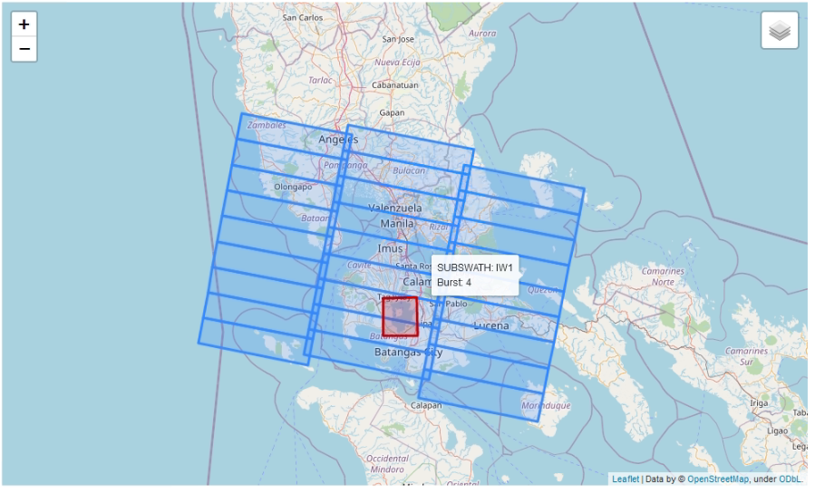

# S1-TOPS-SPLIT Analyzer

This code intends to help users easily work with the S1-TOPS-SPLIT function in [SNAP software](https://step.esa.int/main/download/snap-download/) by parsing the XML metadata of Sentinel-1 satellite data and converting it into usable data such as shapefiles or webmaps.

Using S1-TOPS-SPLIT Analyzer you are able to:
* View all subswaths at the same time
* Save S1-TOPS-SPLIT data as a shapefile, JSON, or CSV
* View and interact with S1-TOPS-SPLIT data using a webmap. In addition, you can add a polygon to visualize its extent with regards to the S1-TOPS-SPLIT data



## Installation
Recommended Python version is 3.8. Minimum Python version is 3.6 but this is untested.

Install Python dependencies

`pip install pandas geopandas shapely folium`

## Usage
Copy `TopsSplitAnalyzer.py` to your work directory. Then import the Class by typing:

```python
from topsplitanalyzer import TopsSplitAnalyzer
```

Below is a sample of using `TopsSplitAnalyzer` to create a shapefile and visualize on a webmap. To visualize on a webmap you need to be using Jupyter Notebook.

```python
# Create object
s1 = TopsSplitAnalyzer('S1_image.zip', target_subswaths=['iw1, iw2, iw3'])

# Write to shapefile
s1.to_shapefile('data.shp')

# Get JSON
s1.to_json()

# Write to CSV
s1.to_csv('output.csv')

# Visualize on a webmap with additional polygon
s1.visualize_webmap(polygon='mask.shp')
```
